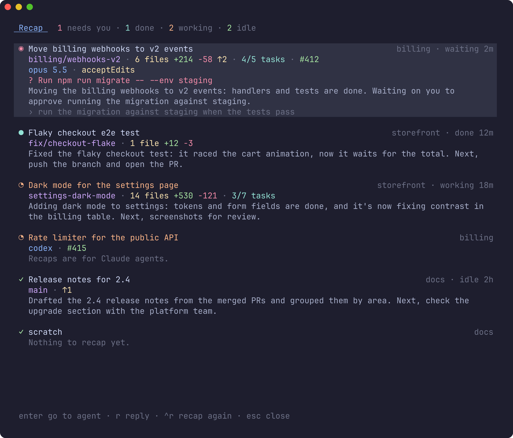
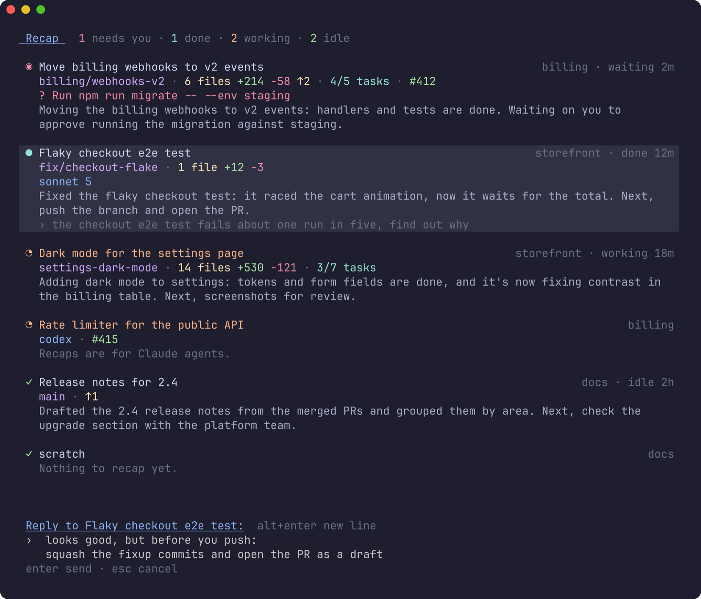

# herdr-recap

Where every agent got to, in one [herdr](https://herdr.dev) popup: what
needs you, what's done, what each one was doing, and a line to answer it
from without leaving the list.



## Why

One agent is a conversation. Five are a job. Each works in its own pane, on
its own branch, at its own pace, and the state of each lives only in that
pane's scrollback. While you're in one, the others carry on without you: one
finishes, one stops to ask permission for a command, one goes down a path
you'd have stopped.

Then you look away for a meeting or lunch, and come back to a sidebar that
says *done*, *done*, *working*, *needs you*. It tells you **that** each agent
moved, not **what** it did, what it's asking, or what's next. So you rebuild
it one pane at a time: open it, scroll up past the tool output, piece
together what you'd asked for and what it made of it, and move on to the
next. Meanwhile the agent that needed a yes has been waiting the whole time,
behind the ones that didn't.

Keeping all of that in your head is the hard part of running several agents
at once. herdr-recap keeps it for you: for every agent, a one-line recap of
where it got to, written while you were away, with the details that decide
what to look at first.

## Scan the list

Open it (`prefix+alt+p`) and read down. Each agent is a few lines:

- **Status first, what needs you at the top.** herdr's own glyphs and colours:
  `◉` needs you, `◔` working, `●` done, `✓` idle. Within a status, whatever
  has waited longest comes first, and the right side says for how long:
  *waiting 2m*, *done 12m*, *working 18m*.
- **What it's waiting for.** An agent stopped on a question or an approval
  shows it in red: the question, or the command or edit it wants to run.
- **Where it got to.** Claude Code's own recap of the session: the goal, the
  current step, the next one. The same summary Claude shows when you come
  back to a session, for every session at once.
- **The state of its work.** Its branch; uncommitted and unpushed changes
  (*6 files +214 −58 ↑2*); its task list (*4/7 tasks*); and whatever the
  pane's other plugins report, such as its PR from herdr-github.
- **The selected agent** also shows the last thing you asked it, its model,
  and its permission mode when that isn't the default.

`enter` (or a click) goes to the agent. Recaps are written ahead of time, so
the list is complete the moment it opens.

## Reply from the list

Most of what an agent needs from you is short: *yes, go ahead*, *push it*,
*try the other approach*. Press `r` on it, type, and `enter` sends it, as if
you'd typed it in its pane. The popup stays open, so you can go down the list
answering each in turn.



Replies can run to several lines (`alt+enter` or `ctrl+j` for a new one, or
paste). An agent stopped on a question or an approval can't take a typed
reply, so for those the popup says so, and `enter` takes you to answer it
there.

**Contents:** [Requirements](#requirements) · [Install](#install) ·
[Keys](#keys) · [When recaps are written](#when-recaps-are-written) ·
[What it costs](#what-it-costs) · [Configuration](#configuration) ·
[Privacy](#privacy) · [Troubleshooting](#troubleshooting) ·
[How it works](#how-it-works) · [Development](#development)

## Requirements

- **herdr 0.9.0** or later.
- **Claude Code** with `/recap` (2.1.x), signed in. Recaps and the details
  from the conversation are Claude-only; other agents are listed with their
  status, title, branch and changes.
- **Linux** or **macOS**, on arm64 or x86-64.

## Install

```sh
herdr plugin install mrolafsson/herdr-recap
```

The build step compiles it with Go if you have it, or downloads the release
binary for your platform and checks its SHA-256.

Bind it to a key in `~/.config/herdr/config.toml`:

```toml
[[keys.command]]
key = "prefix+alt+p"
type = "plugin_action"
command = "herdr-recap.open"
```

On macOS, `alt` needs Option to send Alt in your terminal (Ghostty:
`macos-option-as-alt = true`).

Then `herdr server reload-config`, and **start a new herdr client** (detach
and run `herdr` again): a client that was already open keeps the key
bindings it started with.

`Recap: demo (fictional agents)` in the command palette shows it on made-up
agents: no Claude calls, safe to screenshot.

## Keys

| Key | Does |
| --- | --- |
| `↑` `↓`, `k` `j`, `ctrl+p` `ctrl+n` | move |
| `pgup` / `pgdn`, `g` / `G` | page, first / last |
| `enter`, click | go to that agent and close |
| `r` | reply to that agent: type, then `enter` to send, `esc` to drop it; `alt+enter` or `ctrl+j` for a new line |
| `ctrl+r` | write that agent's recap again, now |
| `esc`, `q` | close |

The footer's hints are buttons too.

A recap written before the agent carried on says how old it is (*recap from
20m ago*) and is drawn dimmer until it's rewritten, which opening the popup
does straight away.

## When recaps are written

Soon after a turn ends. When a Claude agent finishes (done) or stops to ask
you something (blocked), herdr tells the plugin, which waits
`recap_after_seconds` (3 minutes). If by then you still haven't looked at the
agent, its recap is written; if you have (done turns to idle) or you answered
it, nothing is spent. So the agents you're working with cost nothing, and the
ones you walked away from are recapped by the time you're back.

Opening the popup also rewrites any recap that no longer matches its
conversation, for example an agent that has carried on working, a few at a
time, in the background. The rows show what's already there meanwhile.

## What it costs

A recap is one short Claude request on the agent's own conversation, billed
like any other (or counted against your plan). Written soon after the turn,
it reuses the agent's prompt cache: in testing, about 2¢ at list price on a
~70k-token conversation, and a few cents on bigger ones. Once the cache has
expired (5 minutes by default, an hour on some plans) the whole conversation
is read again, which costs several times more. That's why the wait is 3
minutes: keep `recap_after_seconds` under your cache's lifetime.

At most one recap per agent each time you walk away from it: an agent
sitting in done starts no new turns.

Everything else on a row (the waiting question, tasks, branch, changes) is
read from files and git on your machine, and costs nothing.

## Configuration

Optional: `config.json` in the plugin's config directory
(`~/.config/herdr/plugins/config/herdr-recap/`). See
[config.example.json](config.example.json).

| Key | Default | Meaning |
| --- | --- | --- |
| `recap_after_seconds` | `180` | How long an agent waits on you, unlooked at, before its recap is written |
| `claude` | the agent's own | The Claude Code binary to run recaps with. By default the one the agent runs, found on the agent's PATH (herdr's own PATH often lacks `~/.local/bin`) |
| `timeout_seconds` | `120` | The longest one recap may take |
| `theme` | ask the terminal | `"dark"` or `"light"` background |
| `tokens` | all | Which pane tokens to show, in order, e.g. `["pr"]`. By default all, less herdr-github's `pr_*` details when its `pr` is there |

Colours come from herdr's theme: the title in its brightest text, then the
recap, then the details, each kind in its own colour.

## Privacy

Recaps are made by the same Claude Code, account and settings the agent uses,
on its own conversation, so nothing goes anywhere it hadn't already. They're
kept in `~/.local/state/herdr/plugins/herdr-recap/recaps/`, one small file
per session, readable only by you.

The recap is a fork of the conversation that is never saved: the agent's own
session isn't written to, and it doesn't show up in `claude --resume`. It
does run with your Claude Code settings, so your own hooks (a notification on
stop, say) run for it too.

## Troubleshooting

- **`herdr-recap list`** shows, without drawing the popup, each agent, the
  Claude session it was found to be running, everything read from it
  (branch, tasks, the pending request, changes) and its cached recap.
- **`herdr-recap recap w1:p2`** writes one pane's recap now and prints it,
  with any error in full.
- **`recap.log`** in the state directory has every recap written in the
  background, with its cost, and any errors.
- *The key does nothing*: herdr clients read key bindings when they start, and
  `reload-config` doesn't reach one that's already open. Start a new client.
  With several attached (another terminal, a mosh session), close the ones
  you don't use: a popup can open on whichever herdr counts as active.
- *It lists only some of my agents*: it shows the herdr it's installed in.
  Agents on another machine you've connected in herdr's sidebar need the
  plugin installed there, and appear in that machine's popup.
- *Couldn't find its conversation*: the plugin reads Claude's process to find
  its session (its `CLAUDE_CONFIG_DIR` and `sessions/<pid>.json`). A Claude
  Code too old to write that file, or one running as another user, can't be
  read.

## How it works

The popup reads herdr's agent list every second over its socket, so statuses
stay live. For each Claude agent it finds the session through the pane's
`claude` process rather than herdr's reported session ID, which under a
profile switcher (clauth and the like) can name a different session: the
process's `CLAUDE_CONFIG_DIR` (from `/proc` on Linux, `ps` on macOS) leads
to `sessions/<pid>.json`, which names the session and where it was started.

The rest of a row comes from the end of the session's transcript: the last
tool call without a result (what a blocked agent is asking), its task list,
branch, model, mode, your last prompt, and when each happened. Changes come
from `git status` and `git diff --shortstat` in the agent's folder, read
again only when its status changes.

A recap runs

```sh
claude -p --resume <session> --fork-session --no-session-persistence --output-format json /recap
```

in the session's directory with the agent's `CLAUDE_CONFIG_DIR` and without
herdr's environment (so herdr's own Claude hooks don't mistake it for an
agent). It's cached with the transcript's size and time, and counts as
current until the transcript changes. One recap per session runs at a time:
another asking for the same one waits and takes its result.

The `pane.agent_status_changed` hook (`tick`) only reads the agent list and
starts a detached `recap --after` for an agent now waiting on you, once per
status change. That process sleeps, checks the agent's status hasn't moved
since, and writes the recap.

A reply is herdr's `agent.prompt`: the text is pasted into the agent's pane
and entered, as one prompt.

## Development

```sh
go test -race ./...
go run . picker --demo       # the popup on fictional agents, in any terminal
herdr plugin link .          # try it in herdr
sh scripts/screenshots.sh    # docs/images from the demo (needs freeze)
```

`themes_herdr.go` is generated from herdr's palettes by
`scripts/gen-themes.py` (see the script for how).
